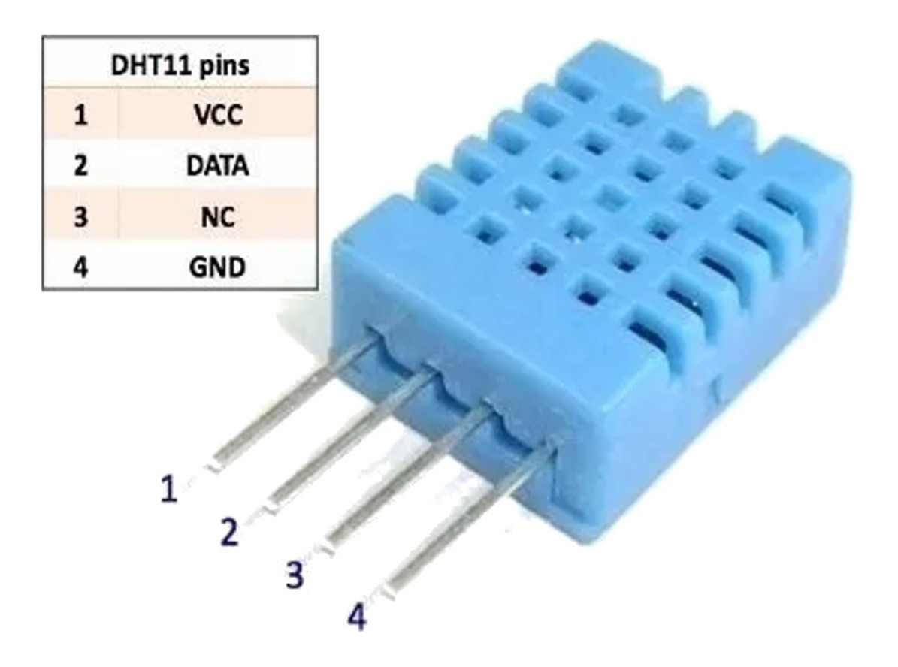
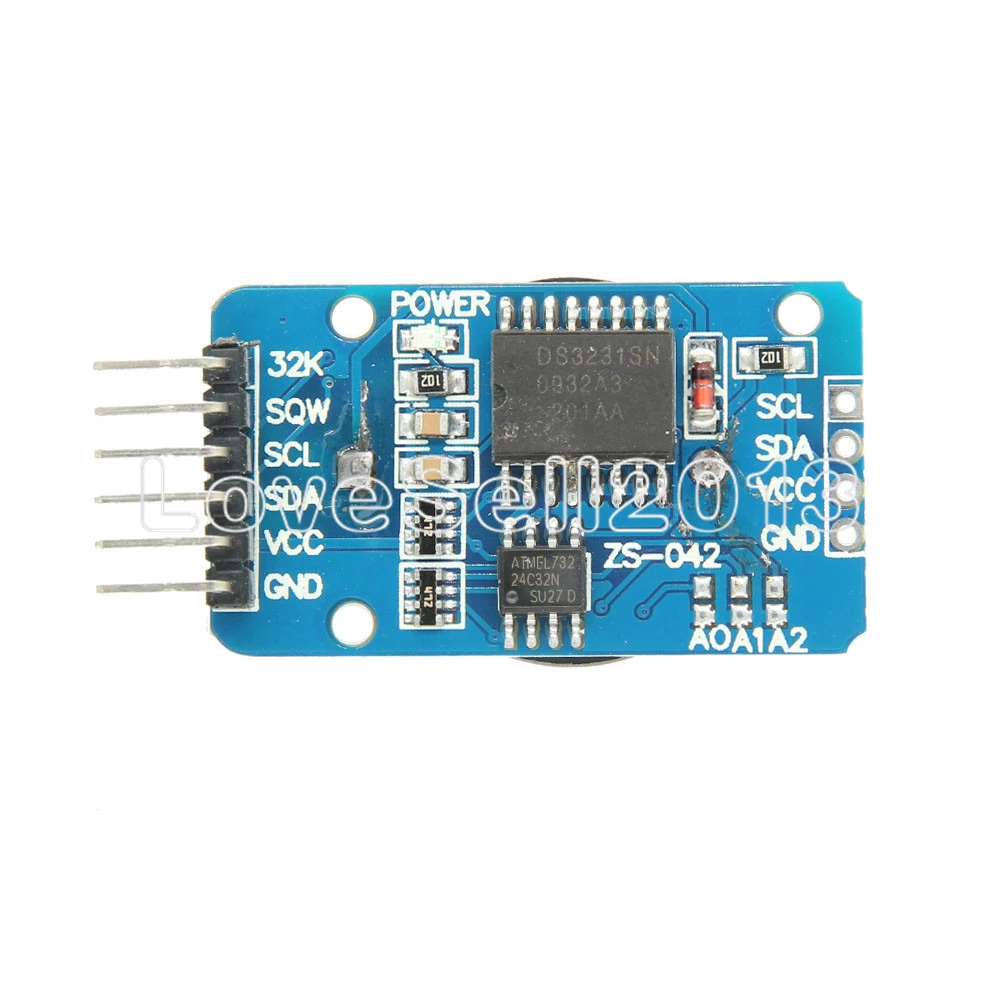
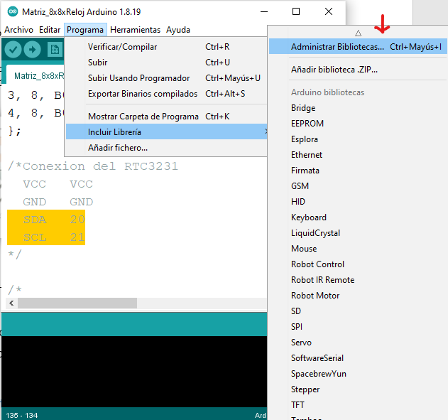
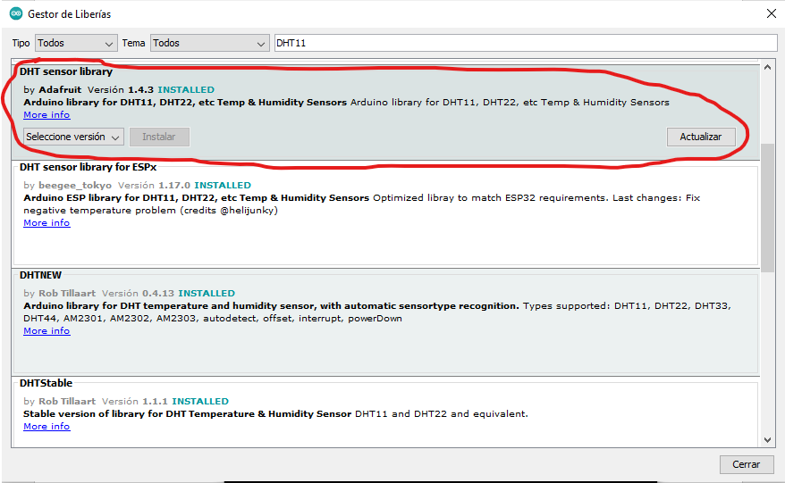
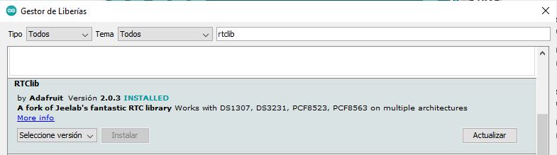
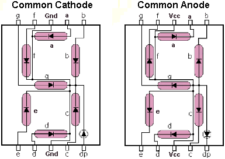
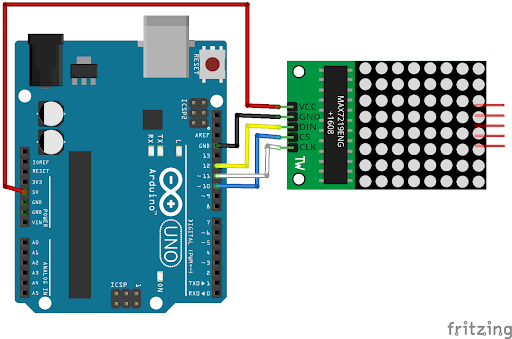
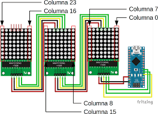
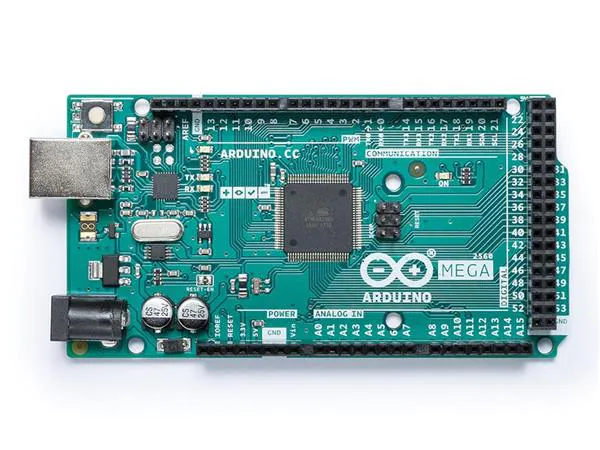

# Matriz Led Arduino
En este proyecto por parte de la escuela Gomara, queremos mostrar la hora y temperatura por medio de display 7segmentos y de Matrices de Led.

Para obtener los datos de temperatura y fecha necesitamos de los siguientes modulos:
-	DHT11 o DHT22 --- Sensor de temperatura y humedad
-	RTC3231 --- Modulo de reloj y fecha con la funcionalidad de Alarma

 

En el sensor DHT11 usaremos los pines excepto NC, conectando:
- VCC --- 5v   
- GND --- GND   
- DATA --- PIN 4 

En el modulo RTC3231 usaremos los pines:
- VCC --- 5v     
- GND --- GND    
- SDA, SCL --- Pines Digitales arduino

## Incluir librerias modulos
Para obtener los datos de los modulos necesitamos de librerias. Para descargar librerias en arduino necesitamos ir a _Programa/Incluir Libreria/Administrar Bibliotecas_

Luego buscamos DHT11 y seleccionamos la libreria con autor Adafuit (podes descargar cualquier version).

Y para el Modulo RTC3231

## Mostrar los datos
Listo ya tenemos las librerías instaladas y el programa funcionando obteniendo los datos de temperatura y hora, ahora falta mostrar los datos para que el usuario lo pueda visualizar.

Para mostrar los datos usaremos Display 7 segmentos para mostrar la hora y matrices de led para mostrar la temperatura, humedad y la fecha.

En los Display de 7 segmentos podemos tener dos tipos, anodo comun o catodo comun, modificando su cableado como muestra en la imagen. Tambien es necesario agregarle resistencias antes de conectar al Arduino ya que los LED del display de 7 segmentos soportan 2v (si son grandes los display funcionan con 8v o 9v) y el arduino entrega 5v como salida. Hay que tener en cuenta el [multiplexado](#multiplexado) para mostrar la hora sin que muestre numeros repetidos.

Para la matriz de led es mucho mas sencillo ya que la [libreria](#libreria-matriz-de-led) junto con el programa lo hace todo. En los pines rojos son los pines de salida para conectar otras matrices para que haga la funcion de cascada, mostrando un texto completo por ejemplo.

Los pines **DIN CS CLK** los conectamos en los pines digitales del arduino, la alimentacion del mismo necesita de 5v para funcionar.

## Cerebro de nuestro programa
Ya con estos conceptos necesitamos saber que arduino utilizar para el cerebro de toda nuestra logica, existen muchos tipos de arduino, nosotros usaremos un **Arduino MEGA**.

Para realizar la logica de nuestro programa usaremos el IDE (Integrated development environment) oficial de arduino lo podemos descargar por la pagina oficial o por Microsoft Store (si es que tienes Windows 10).
[Download Arduino](https://www.arduino.cc/en/software)

## Multiplexado
Si queremos mostrar que son las 16 30 tenemos en cada display un numero distinto, para esto necesitamos prender un solo display, mostrar el numero  1 y luego apagar y prender el siguiente display mostrando un 6 y asi sucesivamente, el tiempo entre display tiene que ser un tiempo muy corto aproximadamente 25 nanosegundos cosa que no sea visible por el ojo humano.

## Libreria Matriz de Led
Para la matriz de led necesitamos incluir la libreria por fuera 